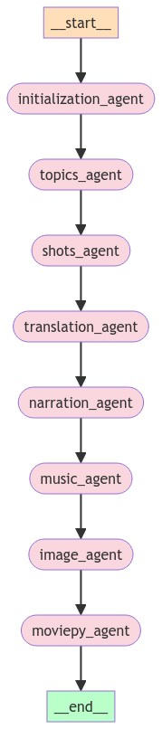

# Agents of Inference

Agents of Inference is an application that generates short films about British secret agents, inspiried by the 007 book and film series. This project is my submission for the Generative AI Agent Developer Contest by NVIDIA and LangChain. Here's the project submission video posted on X:

<blockquote class="twitter-tweet tw-align-center" data-theme="dark"><p lang="en" dir="ltr">Agents of Inference<br>🍸🤵🏼‍♂️⚡️🎥🎬<a href="https://twitter.com/hashtag/NVIDIADevContest?src=hash&amp;ref_src=twsrc%5Etfw">#NVIDIADevContest</a> <a href="https://twitter.com/hashtag/LangChain?src=hash&amp;ref_src=twsrc%5Etfw">#LangChain</a> <a href="https://twitter.com/NVIDIAAIDev?ref_src=twsrc%5Etfw">@NVIDIAAIDev</a> <a href="https://t.co/VT3rgzFbD6">pic.twitter.com/VT3rgzFbD6</a></p>&mdash; Brian Caffey (@briancaffey) <a href="https://twitter.com/briancaffey/status/1802754703207583886?ref_src=twsrc%5Etfw">June 17, 2024</a></blockquote> <script async src="https://platform.twitter.com/widgets.js" charset="utf-8"></script>

## Technology

The project uses the following hardware, software and cloud services:

- Small Language Models (8B) for running local LLM inference
- Large Language Models (70B) provided by NVIDIA AI
- RTX for accelerated stable diffusion and LLM inference
- Stable Diffusion WebUI API for image generation
- Stable Video Diffusion for video generation
- moviepy for combining SVD clips
- ffmpeg for frame interpolation

## Installation

Use poetry to install project dependencies.

The project supports a hybrid inference model, allowing for the application to call out to local Language Model and stable diffusion inference APIs.

### RTX Inference Dependencies

To run the program with local inference services, install and run the following:

- ComfyUI with the ComfyUI_TensorRT custom node package installed
- Build the engines for Stable Diffusion and Stable Video Diffusion XT (see files in `agents_of_inference/comfyui` for more details)
- [NVIDIA NIM inference microservice for Meta/Llama-3-8B-Instruct](https://build.nvidia.com/explore/discover?snippet_tab=Docker#llama3-8b). I have tested this on WSL, this may require that you change your UEFI/BIOS to use CPU graphics. If you prefer to use cloud APIs for LLM inference, please see instructions below

### Cloud Inference

To run the project using NVIDIA AI endpoints, configure an `NVIDIA_API_KEY` value in `.env`.

### LangSmith

To use LangSmith for tracing, add the following to the `.env` file:

```
# LangSmith
LANGCHAIN_TRACING_V2="true"
LANGCHAIN_API_KEY=lsv2_pt_abc_123_xyz
```

## Usage

To run the program, first create an `.env` file from the `.env.example` file with the appropriate keys and values. Then execute the following command:

```
poetry run python agents_of_inference/main.py
```

## LangGraph

This project is built with LangChain and LangGraph. Program execution invokes a network of agents depcited in the following graph:



It is mostly a linear process, but the synopsis is generated multiple times based on a feedback loop defined by conditional edges in the graph.

## Sample Output

Here is example output for running in a local inference environment. The synopsis is generated multiple times based on feedback from the

```
~/git/github/agents-of-inference$ poetry run python agents_of_inference/main.py
## 📀 Using local models 📀 ##
## 🎭 Generating Cast 🎭 ##
## 🗺️ Generating Locations 🗺️ ##
## ✍️ Generating Synopsis ✍️ ##
## going to synopsis_review_agent ##
## 📑 Reviewing Synopsis 📑 ##
## ✍️ Generating Synopsis ✍️ ##
## going to synopsis_review_agent ##
## 📑 Reviewing Synopsis 📑 ##
## ✍️ Generating Synopsis ✍️ ##
## going to scene_agent ##
## 📒 Generating Scenes 📒 ##
## 🎬 Generating Shots 🎬 ##
## Generated 5 shots for scene 1/5 ##
## Generated 5 shots for scene 2/5 ##
## Generated 5 shots for scene 3/5 ##
## Generated 5 shots for scene 4/5 ##
## Generated 5 shots for scene 5/5 ##

000/0025
A medium shot of a bustling Tokyo street, with neon lights reflecting off wet pavement. Jim Thompson, dressed in a black leather jacket and dark jeans, walks purposefully through the crowd, his piercing blue eyes scanning the area. The sound design features the hum of traffic and chatter of pedestrians.
Generated image output/1718426686/images/000.png

001/0025
A tight close-up shot of Emily Chen's face, her piercing brown eyes intense as she briefs Jim on the situation. Her short black hair is styled neatly, and she wears a crisp white blouse with a silver necklace. The camera lingers on her lips as she speaks, emphasizing the importance of the information.
Generated image output/1718426686/images/001.png

[...]

Generated video output/1718426686/videos/000.mp4
== stable video diffusion generation complete ==
Generated video output/1718426686/videos/001.mp4
== stable video diffusion generation complete ==
```

## TODO

- Add agent/node for frame interpolation with ffmpeg

```
ffmpeg -i output/1719717009/final.mp4 -crf 10 -vf "minterpolate=fps=14:mi_mode=mci:mc_mode=aobmc:me_mode=bidir:vsbmc=1" output/1719717009/final.14fps.mp4
```

```python
import ffmpeg

input_file = 'input.mp4'
output_file = 'output.14fps.mp4'

(
    ffmpeg
   .input(input_file)
   .output(output_file, crf=10, vf="minterpolate=fps=14:mi_mode=mci:mc_mode=aobmc:me_mode=bidir:vsbmc=1")
   .run()
)
```
